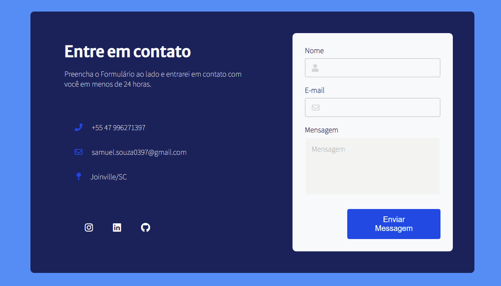

<h1>Contact Page Design</h1>

<h1 align="center">
    
</h1>

<h2>Sobre o Projeto</h2>

Nessa página de contato eu utilizei como referência um projeto no Dribble feito por <a href="https://dribbble.com/shots/14139115-Contact-Form-02">Erşad Başbağ</a>.
 

Essa aplicação foi inspirada nos desafios do <a href="https://www.florin-pop.com/blog/2019/09/100-days-100-projects/">Florin Pop</a>.

<h2>Tecnologias</h2>

As seguintes ferramentas foram usada na construção do projeto.

<ul>
    <li>HTML</li>
    <li>CSS</li>
</ul>

<h2>Pré Requisitos para execução do Projeto</h2>

Poderá executar a aplicação no CodePen: <a href="https://codepen.io/souzasamuelp/full/dyzMYxQ">Contact Page Design</a>

Ou para executar em um editor de código, será necessário instalar:

<ul>
    <li>VSCode;</li>
    <li>No VSCode, a extensão "Live Server";</li>
</ul>

Ao abrir no VSCode o projeto e clicar para abrir a página do Live Server, ficará vísivel o projeto.

Veja meu Linkedin: <a href="https://www.linkedin.com/in/souzasamuelp/">Samuel Souza</a>

Veja meu Github: <a href="https://github.com/souzasamuelp">Samuel Souza</a>
